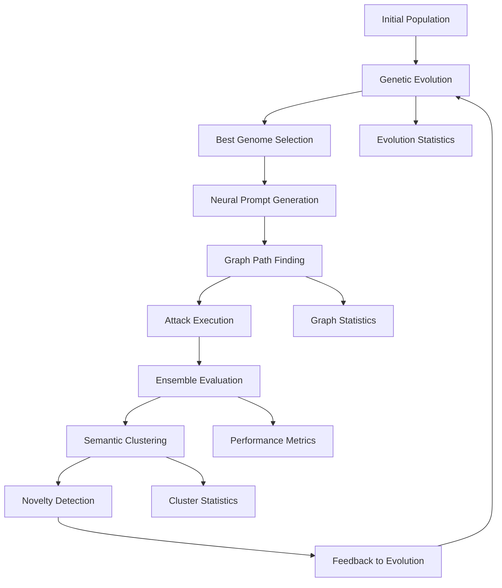

# Revolutionary Red-Teaming System - Technical Architecture

## System Overview

This document provides a technical deep-dive into the revolutionary red-teaming system that completely transforms the original agent-based architecture. Every component has been reimagined using cutting-edge techniques from evolutionary computation, neural networks, graph theory, and machine learning.

## Architectural Comparison

### Original vs Revolutionary Architecture

| Component | Original Approach | Revolutionary Approach | Key Innovation |
|-----------|------------------|----------------------|----------------|
| **Orchestration** | Thompson Sampling multi-armed bandits | Genetic Algorithm evolution | Population-based learning with multi-objective optimization |
| **Prompt Generation** | Template-based mutations | Neural vector evolution | Semantic embeddings with transformer-based generation |
| **Evaluation** | Heuristics + single LLM judge | Ensemble of specialized evaluators | Multiple evaluation perspectives with uncertainty quantification |
| **Task Scheduling** | Queue-based FIFO processing | Graph-based exploration | Strategic pathfinding through attack space |
| **Novelty Detection** | MinHash + Jaccard clustering | Semantic embedding clustering | Deep understanding of semantic similarity |
| **Architecture** | Agent-based modular system | Functional pipeline with data flow | Composable stages with parallel execution |

## Core Components Deep Dive

### 1. Functional Pipeline Architecture

**File**: `apps/runner/app/pipeline/__init__.py`

The foundation replaces rigid agent classes with composable pipeline stages:

```python
class PipelineStage(ABC):
    """Abstract base class for all pipeline stages"""
    
    @abstractmethod
    async def process(self, data: Any, context: PipelineContext) -> Any:
        """Process data through this pipeline stage"""
        pass

class FunctionalPipeline:
    """Revolutionary functional pipeline with parallel execution"""
    
    def add_stage(self, stage: PipelineStage) -> 'FunctionalPipeline'
    def add_parallel_stages(self, group_name: str, stages: List[PipelineStage]) -> 'FunctionalPipeline'
    async def execute(self, initial_data: Any, context: PipelineContext) -> Any
```

**Key Features**:
- **Composable**: Stages can be combined in any order
- **Parallel Execution**: Multiple stages can run concurrently
- **Context Flow**: Shared context flows through all stages
- **Error Resilience**: Failed stages don't crash the entire pipeline

### 2. Genetic Algorithm Orchestrator

**File**: `apps/runner/app/pipeline/genetic_orchestrator.py`

Replaces Thompson Sampling with evolutionary optimization:

#### Attack Genome Representation
```python
@dataclass
class AttackGene:
    category: str                    # Attack category
    strategy_type: str              # Strategy within category  
    mutation_strength: float        # 0.0 to 1.0
    complexity_level: int          # 1 to 5
    language_variant: str          # Language/locale
    psychological_trigger: str     # Psychological approach
    encoding_method: str           # Encoding technique
    timing_pattern: str            # Timing strategy

@dataclass 
class AttackGenome:
    genes: List[AttackGene]
    fitness_score: float
    generation: int
    parent_ids: List[str]
    mutation_history: List[str]
    success_metrics: Dict[str, float]
```

#### Multi-Objective Fitness Function
```python
class MultiObjectiveFitness(FitnessFunction):
    """Optimizes for multiple objectives simultaneously"""
    
    def __init__(self, weights: Dict[str, float] = None):
        self.weights = weights or {
            'success_rate': 0.3,      # Attack success
            'novelty_score': 0.25,    # Novelty/uniqueness
            'stealth_score': 0.2,     # Detection avoidance
            'efficiency': 0.15,       # Cost/time efficiency
            'coverage': 0.1           # Attack surface coverage
        }
```

#### Adaptive Genetic Operators
- **Tournament Selection**: Selects parents based on fitness
- **Adaptive Crossover**: Learns successful gene combinations
- **Self-Adapting Mutation**: Adjusts mutation rates based on population diversity

### 3. Neural Prompt Generation

**File**: `apps/runner/app/pipeline/neural_generator.py`

Replaces template mutations with neural evolution:

#### Neural Prompt Vectors
```python
@dataclass
class NeuralPromptVector:
    intent_vector: List[float]        # Semantic intent (128-dim)
    style_vector: List[float]         # Writing style (64-dim)  
    complexity_vector: List[float]    # Complexity markers (32-dim)
    adversarial_vector: List[float]   # Adversarial signals (64-dim)
    linguistic_vector: List[float]    # Language patterns (32-dim)
```

#### Transformer Evolution
```python
class TransformerEvolution(NeuralGenerator):
    """Evolves prompts using transformer guidance"""
    
    async def _adversarial_evolution(self, vector, context) -> GeneratedPrompt
    async def _semantic_drift(self, vector, context) -> GeneratedPrompt  
    async def _cross_category_blend(self, vector, context) -> GeneratedPrompt
    async def _stealth_optimization(self, vector, context) -> GeneratedPrompt
```

#### Adversarial Optimizer
```python
class AdversarialOptimizer(NeuralGenerator):
    """Uses feedback to iteratively improve prompts"""
    
    async def _optimize_for_success(self, vector, previous_attempts)
    async def _optimize_for_stealth(self, vector, previous_attempts)
    async def _optimize_for_novelty(self, vector, previous_attempts)
```

### 4. Ensemble Scoring System

**File**: `apps/runner/app/pipeline/ensemble_scoring.py`

Replaces simple evaluation with sophisticated ensemble:

#### Specialized Evaluators
```python
class SemanticVulnerabilityEvaluator(SpecializedEvaluator):
    """Deep semantic analysis of vulnerabilities"""
    
class AdversarialRobustnessEvaluator(SpecializedEvaluator):
    """Game-theoretic robustness evaluation"""
    
class BehavioralAnomalyEvaluator(SpecializedEvaluator):
    """Statistical analysis of behavioral anomalies"""
    
class ContextAwarenessEvaluator(SpecializedEvaluator):
    """Multi-turn conversation manipulation detection"""
```

#### Score Fusion Engine
```python
class ScoreFusionEngine:
    """Advanced fusion of multiple evaluation scores"""
    
    def _weighted_average_fusion(self, components, context)
    def _dynamic_weighted_fusion(self, components, context)  
    def _bayesian_fusion(self, components, context)
    def _ensemble_vote_fusion(self, components, context)
    def _uncertainty_weighted_fusion(self, components, context)
```

### 5. Graph-based Exploration

**File**: `apps/runner/app/pipeline/graph_explorer.py`

Replaces queue scheduling with intelligent graph traversal:

#### Attack Space Graph
```python
class AttackSpaceGraph:
    """Graph representation of attack space"""
    
    nodes: Dict[str, ExplorationNode]
    edges: List[ExplorationEdge]
    graph: nx.DiGraph  # NetworkX for algorithms
    
    def evolve_graph(self) -> None:
        """Dynamically evolve based on exploration results"""
```

#### Pathfinding Algorithms
```python
class AdaptiveAStarPathfinder(PathFinder):
    """A* with learned heuristics"""
    
    async def _astar_search(self, graph, start, goal, strategy, max_depth)
    def _heuristic(self, graph, current, goal, strategy) -> float
    
class MultiObjectivePathfinder(PathFinder):
    """Pareto-optimal pathfinding"""
    
    def _find_pareto_optimal_paths(self, path_solutions)
    def _select_from_pareto_set(self, pareto_paths, constraints)
```

#### Dynamic Explorer
```python
class DynamicExplorer:
    """Adaptive exploration engine"""
    
    async def explore_next(self, current_node, constraints) -> Tuple[List[str], Dict[str, Any]]
    def _adapt_exploration_strategy(self) -> None
    def report_exploration_result(self, path, success, reward, novel_discoveries)
```

### 6. Semantic Clustering

**File**: `apps/runner/app/pipeline/semantic_clustering.py`

Replaces MinHash with deep semantic understanding:

#### Embedding Generation
```python
class HybridEmbeddingGenerator(EmbeddingGenerator):
    """Combines multiple embedding techniques"""
    
    async def generate_embedding(self, text, context) -> np.ndarray:
        # Transformer embedding (70% weight)
        transformer_emb = await self.transformer_generator.generate_embedding(text, context)
        
        # TF-IDF embedding (20% weight)  
        tfidf_emb = self._generate_tfidf_embedding(text)
        
        # Structural embedding (10% weight)
        structural_emb = self._generate_structural_embedding(text)
        
        # Weighted combination
        return combined_embedding
```

#### Adaptive Clustering
```python
class AdaptiveClusteringEngine:
    """Selects best clustering algorithm dynamically"""
    
    clustering_algorithms = {
        'dbscan': self._dbscan_clustering,
        'hierarchical': self._hierarchical_clustering, 
        'spectral': self._spectral_clustering,
        'adaptive': self._adaptive_clustering
    }
    
    def _select_best_clustering_method(self, embeddings) -> str
    def _ensemble_clusterings(self, embeddings, clusterings) -> List[SemanticCluster]
```

#### Semantic Deduplication
```python
class SemanticDeduplicationSystem:
    """Intelligent novelty detection and deduplication"""
    
    async def process_new_finding(self, text, vulnerability_category, context) -> Tuple[bool, float, Optional[SemanticCluster]]
    async def reorganize_clusters(self) -> None
    async def batch_process_findings(self, findings) -> Dict[str, Any]
```

## Integration Layer

**File**: `apps/runner/app/pipeline/revolutionary_integration.py`

Orchestrates all components into a unified system:

### Revolutionary System
```python
class RevolutionaryRedTeamingSystem:
    """Complete revolutionary red-teaming system"""
    
    def __init__(self, model_client, config: RevolutionaryRunConfig):
        self._initialize_subsystems()
        self._build_pipeline()
    
    async def run_revolutionary_campaign(self, max_attempts) -> Dict[str, Any]
    async def _execute_single_attempt(self) -> Dict[str, Any]
    async def _update_learning_systems(self, execution_result) -> None
```

### Pipeline Flow
1. **Evolutionary Stage**: Evolve attack genome using genetic algorithms
2. **Neural Generation Stage**: Generate prompt using neural techniques  
3. **Graph Exploration Stage**: Find optimal attack path through graph
4. **Execution Stage**: Execute attack against target model
5. **Evaluation Stage**: Comprehensive ensemble evaluation
6. **Clustering Stage**: Semantic clustering and novelty detection

## Data Flow Architecture



## Performance Characteristics

### Computational Complexity

| Component | Time Complexity | Space Complexity | Scalability |
|-----------|----------------|------------------|-------------|
| Genetic Evolution | O(P × G × F) | O(P × L) | Excellent |
| Neural Generation | O(T × D) | O(D) | Good |
| Ensemble Evaluation | O(E × C) | O(E) | Good |
| Graph Exploration | O(V + E log V) | O(V + E) | Excellent |
| Semantic Clustering | O(N² × D) | O(N × D) | Moderate |

Where:
- P = Population size, G = Generations, F = Fitness evaluation cost
- L = Genome length, T = Text length, D = Embedding dimension
- E = Number of evaluators, C = Evaluation cost
- V = Graph vertices, E = Graph edges, N = Number of embeddings

### Memory Management

- **Genetic Populations**: Bounded by configuration
- **Embedding Cache**: Automatic LRU eviction 
- **Graph Memory**: Dynamic node/edge management
- **Cluster Storage**: Automatic reorganization and pruning

### Concurrency Model

- **Pipeline Stages**: Fully async with configurable concurrency
- **Genetic Operations**: Parallel fitness evaluation
- **Ensemble Evaluation**: Parallel evaluator execution
- **Graph Exploration**: Concurrent path finding

## Configuration Management

### Revolutionary Run Config
```python
@dataclass
class RevolutionaryRunConfig:
    # Genetic Algorithm
    population_size: int = 30
    generations: int = 50
    mutation_rate: float = 0.15
    crossover_rate: float = 0.7
    
    # Neural Generation
    neural_temperature: float = 0.8
    max_evolution_iterations: int = 5
    stealth_optimization: bool = True
    
    # Ensemble Evaluation
    evaluation_fusion_method: str = 'dynamic_weighted'
    confidence_threshold: float = 0.7
    novelty_threshold: float = 0.6
    
    # Graph Exploration
    exploration_strategy: str = 'balanced'
    max_path_depth: int = 8
    diversification_factor: float = 0.3
    
    # Semantic Clustering
    clustering_method: str = 'adaptive'
    similarity_threshold: float = 0.8
    auto_reorganize: bool = True
```

## Error Handling and Resilience

### Fault Tolerance
- **Pipeline Resilience**: Failed stages don't crash entire pipeline
- **Genetic Robustness**: Evolution continues with partial population
- **Evaluation Fallbacks**: Degraded evaluation if components fail
- **Graph Recovery**: Pathfinding adapts to graph changes
- **Clustering Resilience**: Multiple algorithm fallbacks

### Monitoring and Observability
- **Real-time Metrics**: Performance tracking across all components
- **Adaptive Learning**: System learns from successes and failures
- **Health Checks**: Component-level health monitoring
- **Statistics Export**: Comprehensive statistics and reporting

## Testing Strategy

### Test Coverage
- **Unit Tests**: Individual component functionality
- **Integration Tests**: Pipeline and cross-component interactions  
- **Property Tests**: Genetic algorithm properties and invariants
- **Performance Tests**: Scalability and resource usage
- **End-to-End Tests**: Complete campaign execution

### Test File: `tests/test_revolutionary_pipeline.py`
- Validates all major components
- Tests pipeline execution and data flow
- Verifies genetic algorithm properties
- Checks ensemble evaluation correctness
- Validates graph exploration algorithms

## Deployment Considerations

### Resource Requirements
- **CPU**: Multi-core for parallel execution
- **Memory**: 4-8GB for moderate populations and embeddings
- **Storage**: Varies with campaign length and clustering data
- **Network**: API calls to OpenRouter for model interactions

### Scaling Strategies
- **Horizontal**: Multiple system instances for larger campaigns
- **Vertical**: Larger populations and more sophisticated algorithms
- **Hybrid**: Distributed genetic populations with centralized evaluation

## Future Extensions

### Planned Enhancements
1. **Distributed Evolution**: Multi-node genetic algorithms
2. **Advanced Embeddings**: Custom transformer fine-tuning
3. **Real-time Adaptation**: Online learning and strategy adjustment
4. **Multi-modal Evaluation**: Image and audio input analysis
5. **Adversarial Training**: Self-improving defense mechanisms

### Research Directions
- **Quantum-inspired Algorithms**: Quantum genetic algorithms
- **Neuromorphic Computing**: Spiking neural networks for generation
- **Causal Inference**: Understanding attack causality
- **Meta-learning**: Learning to learn attack strategies

## Conclusion

The revolutionary red-teaming system represents a complete paradigm shift from traditional approaches. By combining cutting-edge techniques from multiple domains of AI and computer science, it provides unprecedented capabilities for discovering novel attack vectors while maintaining sophisticated evaluation and learning mechanisms.

The architecture is designed for both immediate effectiveness and long-term evolution, providing a foundation for continued advancement in AI safety and security research.